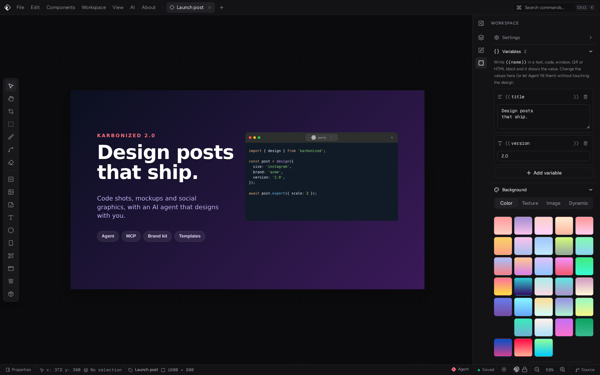

<h1 align="center">Karbonized</h1>


<p align="center">
Karbonized is a visual editor for creating images of code snippets, mockups and social graphics. Arrange blocks — code, text, images, devices, shapes, QR codes and your own HTML components — on a canvas and export the result in seconds.</p>
<p align="center"><b>Free</b> and <b>Open Source</b>. Made with 💙 and ReactJS in 🇨🇺</p>

<div align="center">


</div>

## ✨ What's new in 2.0

* **Agent, the design assistant** — describe the image you want and Agent builds it on the canvas, with Anthropic, OpenAI, Gemini, OpenRouter or local models (Ollama, LM Studio). It follows design standards made for social media, and everything it did undoes in one step.
* **MCP server** — Claude Desktop, Claude Code, Cursor and other MCP clients can design with Karbonized. They start it in the background when it is not open, and exports land in a folder without any dialog.
* **Templates with variables** — write `{{title}}`, `{{date}}` or `{{code}}` in any block and fill them from the Workspace panel (or let Agent do it): the next post is a new value, not a redesign.
* **Brand kit** — your colors, fonts, logos and guidelines in one place. The pickers offer them first and Agent reads them before designing.
* **Drawing tools** — a vector brush that follows pen pressure, shapes drawn by dragging, node editing, an eraser, rulers and guides.
* **Components and icon packs** — a reworked `.kcomponent` library with a starter pack, and icon packs that anyone can make from a folder of SVGs.
* **The whole Google Fonts catalog**, typography controls and text edited right on the canvas.
* **New start screen** with templates, quick sizes and recent projects; a new color picker, a realistic browser mockup and resizable phones.
* **New interface**, a command palette (<kbd>Ctrl</kbd>/<kbd>⌘</kbd> + <kbd>K</kbd>), autosave with undo history, and HTML blocks edited in a real code editor.

See the full [changelog](./CHANGELOG.md).

## 🚀 Features

* **🧱 Block-based canvas:** code snippets, text, images, icons, shapes, freehand strokes, phone and browser mockups, QR codes and HTML blocks. Move, resize, rotate, crop and warp them, select several at once, align and distribute them, group them into layers and undo any change.
* **✏️ Drawing:** a vector brush with pressure, shapes drawn by dragging, node editing, an eraser, rulers and snapping guides.
* **🎨 Backgrounds:** solid colors, gradients, textures, images and dynamic backgrounds, with blur and noise.
* **✨ Agent:** an assistant panel that designs with you using the model of your choice, following design standards for social media. See the [Agent guide](./docs/agent.md).
* **🔌 MCP server:** the desktop app exposes its editing tools to MCP clients like Claude Desktop, Claude Code and Cursor. Clients start it in the background, it can live in the tray, and images are exported straight to a folder.
* **🧩 Templates and brand:** project variables (`{{title}}`) turn any design into a template, and a brand kit keeps your colors, fonts and logos at hand for you and for Agent.
* **🧱 HTML blocks and components:** build your own blocks with HTML/CSS/JS, expose variables as controls and actions as buttons, share them as `.kcomponent` files, and publish icon packs.
* **🔤 Typography:** installed fonts and the whole Google Fonts catalog, with alignment, weight, spacing, outline and shadow.
* **⌨️ Keyboard-first:** a command palette and shortcuts for tools, editing, zoom and exporting.
* **💾 Export:** save your designs as **PNG**, **JPEG** or **SVG** at up to 4× scale, with a transparent background, copy them to the clipboard or share them directly.
* **🗂 Projects:** several workspaces at once, automatic session saving, and `.kproject` files you can save, open and turn into templates.
* **🖥 Multi-platform:** use Karbonized as a Progressive Web App (with **offline** support) or as a desktop app for **Windows**, **Linux** and **macOS**.
* **🆓 Free and open source.**

## ⌨️ Keyboard shortcuts

Press <kbd>Ctrl</kbd>/<kbd>⌘</kbd> + <kbd>K</kbd> to see every command. The most common ones:

| Action | Shortcut |
| --- | --- |
| Command palette | <kbd>Ctrl</kbd> <kbd>K</kbd> |
| Select / Pan / Crop / Warp tools | <kbd>V</kbd> / <kbd>H</kbd> / <kbd>C</kbd> / <kbd>W</kbd> |
| Brush / Edit nodes / Eraser / Shape | <kbd>B</kbd> / <kbd>A</kbd> / <kbd>E</kbd> / <kbd>R</kbd> |
| Rulers and guides | <kbd>Shift</kbd> <kbd>R</kbd> |
| Undo / Redo | <kbd>Ctrl</kbd> <kbd>Z</kbd> / <kbd>Ctrl</kbd> <kbd>Shift</kbd> <kbd>Z</kbd> |
| Select all / Deselect | <kbd>Ctrl</kbd> <kbd>A</kbd> / <kbd>Esc</kbd> |
| Add to or remove from the selection | <kbd>Shift</kbd> + click, or drag on the canvas |
| Duplicate selection | <kbd>Ctrl</kbd> <kbd>D</kbd> |
| Delete selection | <kbd>Delete</kbd> |
| Move selection 1px / 10px | <kbd>←</kbd> <kbd>↑</kbd> <kbd>→</kbd> <kbd>↓</kbd> / with <kbd>Shift</kbd> |
| Align left / center / right | <kbd>Alt</kbd> <kbd>A</kbd> / <kbd>Alt</kbd> <kbd>H</kbd> / <kbd>Alt</kbd> <kbd>D</kbd> |
| Align top / middle / bottom | <kbd>Alt</kbd> <kbd>W</kbd> / <kbd>Alt</kbd> <kbd>V</kbd> / <kbd>Alt</kbd> <kbd>S</kbd> |
| Distribute horizontally / vertically | <kbd>Alt</kbd> <kbd>Shift</kbd> <kbd>H</kbd> / <kbd>Alt</kbd> <kbd>Shift</kbd> <kbd>V</kbd> |
| Toggle snapping | <kbd>Shift</kbd> <kbd>S</kbd> |
| Zoom in / out / 100% / fit | <kbd>Ctrl</kbd> <kbd>+</kbd> / <kbd>Ctrl</kbd> <kbd>−</kbd> / <kbd>Shift</kbd> <kbd>0</kbd> / <kbd>Shift</kbd> <kbd>1</kbd> |
| Lock aspect ratio | <kbd>Ctrl</kbd> <kbd>Shift</kbd> <kbd>L</kbd> |
| Toggle properties panel | <kbd>Ctrl</kbd> <kbd>B</kbd> |
| Show / hide Agent | <kbd>Ctrl</kbd> <kbd>L</kbd> |
| Cycle panel layouts | <kbd>Ctrl</kbd> <kbd>.</kbd> |
| New project / Open project | <kbd>Alt</kbd> <kbd>N</kbd> / <kbd>Ctrl</kbd> <kbd>O</kbd> |
| Save project / Export | <kbd>Ctrl</kbd> <kbd>S</kbd> / <kbd>Ctrl</kbd> <kbd>Shift</kbd> <kbd>E</kbd> |
| Copy image | <kbd>Alt</kbd> <kbd>Shift</kbd> <kbd>C</kbd> |

In the HTML block editor:

| Action | Shortcut |
| --- | --- |
| Save block and return to the canvas | <kbd>Ctrl</kbd> <kbd>S</kbd> |
| Refresh preview | <kbd>Ctrl</kbd> <kbd>Enter</kbd> |
| Toggle explorer / preview panel / console | <kbd>Ctrl</kbd> <kbd>B</kbd> / <kbd>Ctrl</kbd> <kbd>J</kbd> / <kbd>Ctrl</kbd> <kbd>Shift</kbd> <kbd>Y</kbd> |
| Open HTML / CSS / JS | <kbd>Alt</kbd> <kbd>1</kbd> / <kbd>Alt</kbd> <kbd>2</kbd> / <kbd>Alt</kbd> <kbd>3</kbd> |
| Back to the canvas | <kbd>Esc</kbd> |

On macOS use <kbd>⌘</kbd> instead of <kbd>Ctrl</kbd>.

## 📚 Documentation

* [Agent and the MCP server](./docs/agent.md)
* [HTML blocks](./docs/html-blocks.md) and the [HTML block API](./docs/html-block-api.md)
* [Creating and importing components](./docs/kcomponent-guide.md) and the [`.kcomponent` format](./docs/kcomponent-format.md)
* [Making an icon pack](./docs/icon-packs.md)
* [Extensions (plugin system)](./docs/plugin_system.md)

## 🏗 Building

### 🛠️ Requirements

* **Node** >= 18
* **Yarn** 4 (via Corepack: `corepack enable`)

Install the dependencies:

``` bash
yarn install
```

### 🌐 Web app

Start a development server:

``` bash
yarn dev
```

Build for production (type-checks first):

``` bash
yarn build
```

### 🖥️ Desktop app

`yarn install` also downloads the Electron binary (skipped on CI). If it failed, run `node scripts/install-electron.cjs`.

Run **Karbonized** with Electron in development mode:

``` bash
yarn electron:dev
```

Build the desktop app for your system:

``` bash
yarn electron:build
```

The generated binaries are in `./release/{version}/`. Platform-specific builds are available with `yarn build:win`, `yarn build:mac` and `yarn build:linux`.

### ✅ Code quality

``` bash
yarn test     # Vitest unit tests
yarn lint     # ESLint (should report no errors)
yarn format   # Prettier
```

## 🧰 Tech stack

React 18, TypeScript, Vite, Tailwind CSS v4, Radix UI / shadcn/ui, Zustand, Monaco Editor, Electron and Capacitor.

## ©️ Licence

This project is under [Apache-2.0](http://www.apache.org/licenses/LICENSE-2.0) Licence Terms and Conditions.

## 👥 Contribution

Contributions, bug reports and ideas are welcome — open an [issue](https://github.com/yossdotpro/karbonized/issues) or a pull request.
